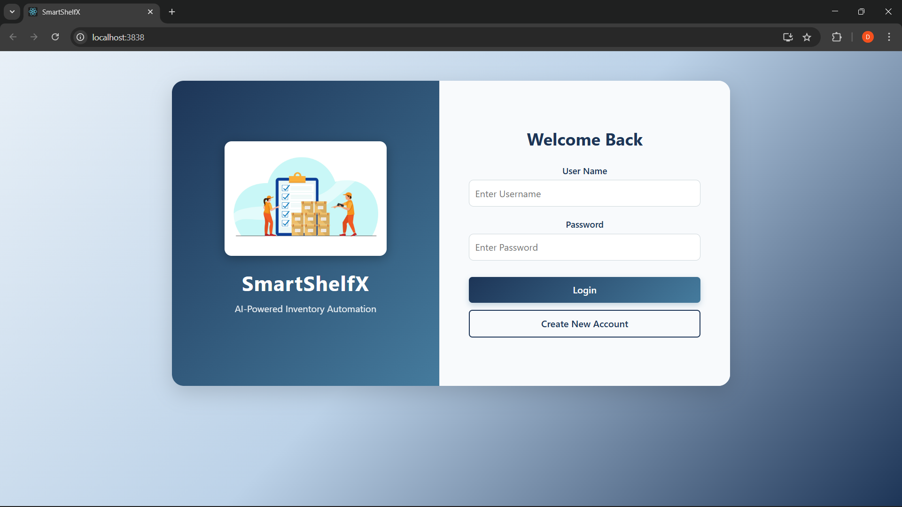
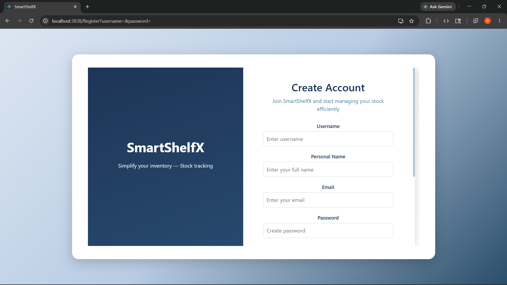
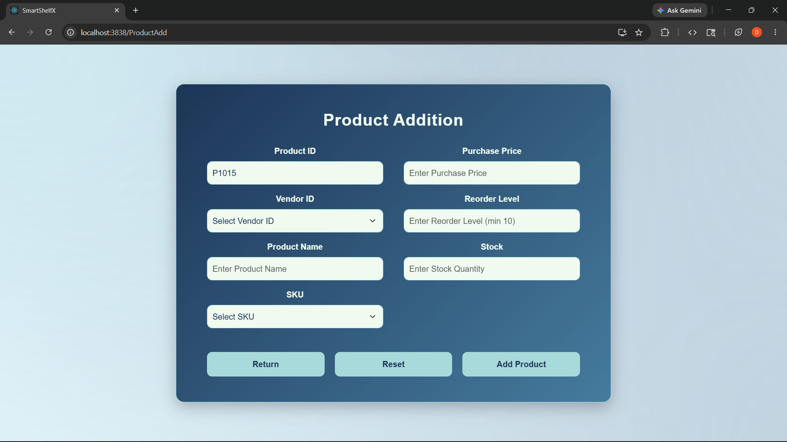
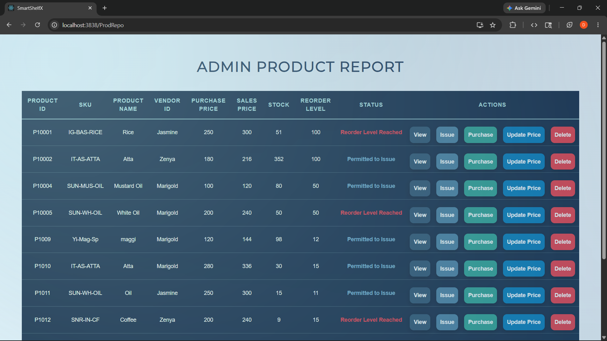
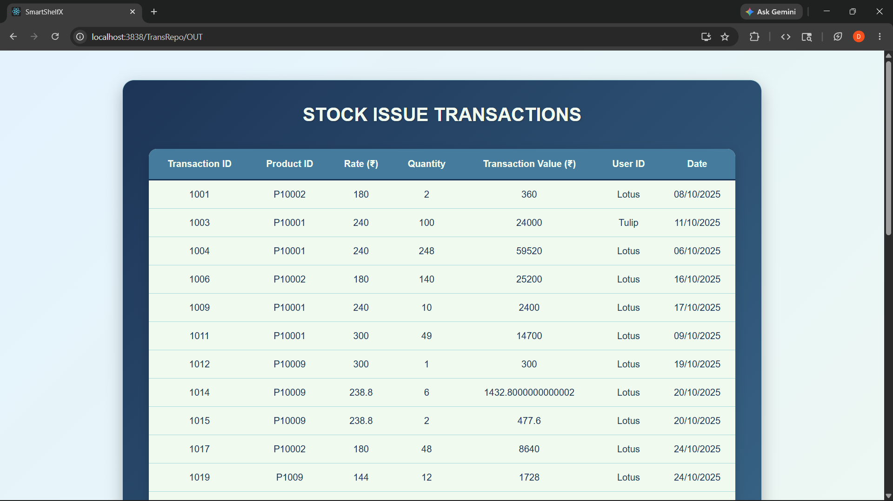
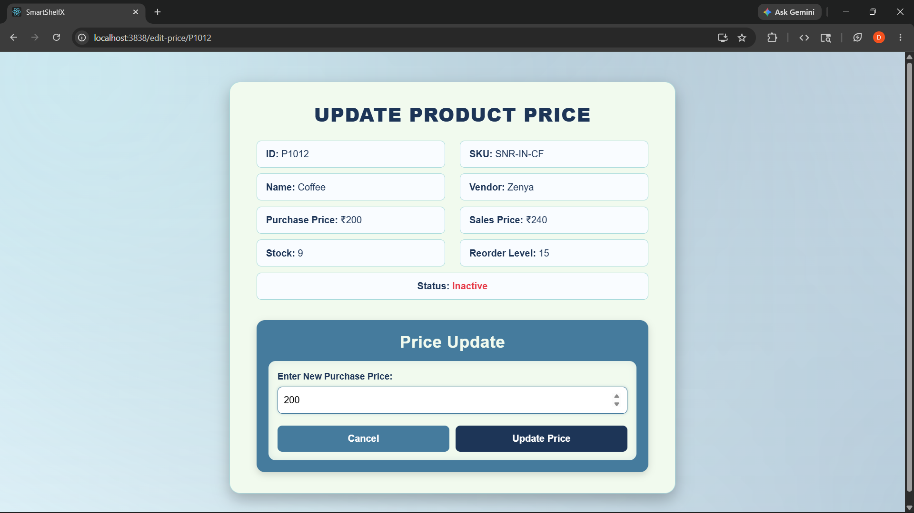
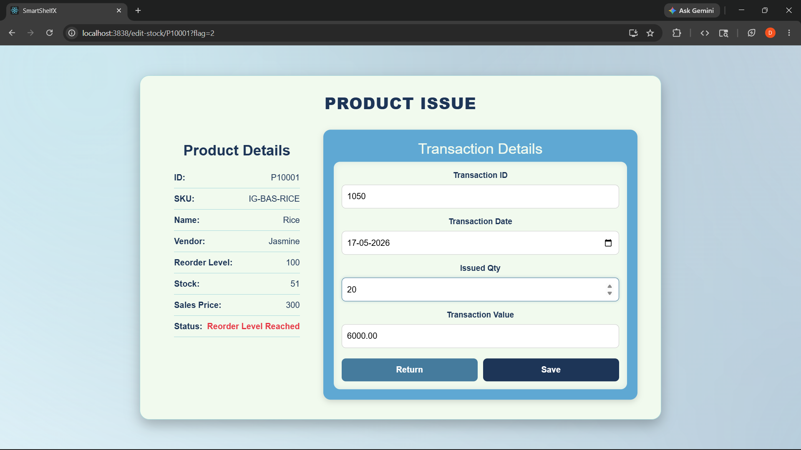
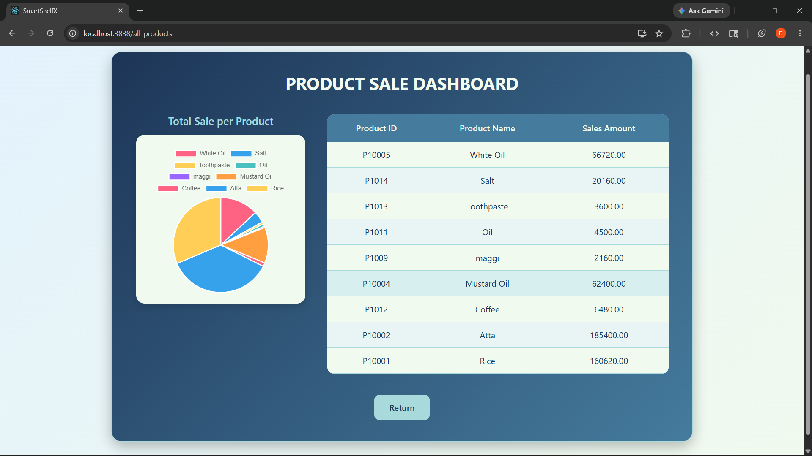

# SmartshelfX - Inventory Management System

A full-stack inventory management application built with Spring Boot on the backend and React.js on the frontend. Designed to manage products, categories, stock levels, and inventory transactions efficiently.

## Demo

▶️ [Live At](https://smartshelf-ashen.vercel.app/) https://smartshelf-ashen.vercel.app/


## Tech Stack

- **Frontend:** React.js, CSS3
- **Backend:** Java, Spring Boot
- **Database:** MySQL (Spring Data JPA)
- **Security:** BCrypt encryption

## Features

- Add, edit, delete and view products
- Category management using SKU
- Stock level tracking
- Inventory transaction management
- Stock issue, purchase and price update operations
- Sales analysis dashboard with visual insights
- REST API with Spring Boot
- Role based access with BCrypt encryption
- Responsive UI with React.js

## Screenshots

### Login


### Register


### Product Addition


### Product List


### Stock Issued Transactions


### Update Price


### Issue Stock


### Sales Analysis Dashboard


## Project Structure

```
inventoryApplication/
├── inventory-front/              # React.js frontend
│   ├── src/
│   └── package.json
└── inventoryApplication/         # Spring Boot backend
    ├── src/
    │   └── main/java/edu/infosys/inventoryApplication
    │       ├── bean/
    │       ├── controller/
    │       ├── config/
    │       ├── service/
    │       └── dao/
    └── pom.xml
```

## Run Locally

### Prerequisites
- Java 17+ installed
- Node.js installed
- MySQL installed and running

### Backend Setup

Open `inventoryApplication` folder in VS Code or IntelliJ IDEA.

Configure `src/main/resources/application.properties`:

```properties
spring.datasource.url=jdbc:mysql://localhost:3306/inventory_db
spring.datasource.username=your_mysql_username
spring.datasource.password=your_mysql_password
spring.jpa.hibernate.ddl-auto=update
```

Run the Spring Boot application:

```bash
mvn spring-boot:run
```

Backend starts on `http://localhost:9898`

### Frontend Setup

```bash
cd inventory-front
npm install
npm start
```

Open `http://localhost:3838` in your browser.


## Author

dharu-dharanic  
[GitHub Profile](https://github.com/dharu-dharanic)